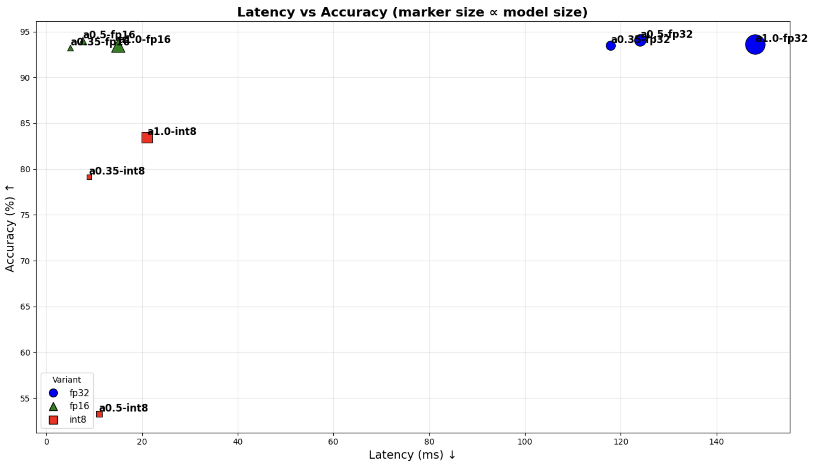
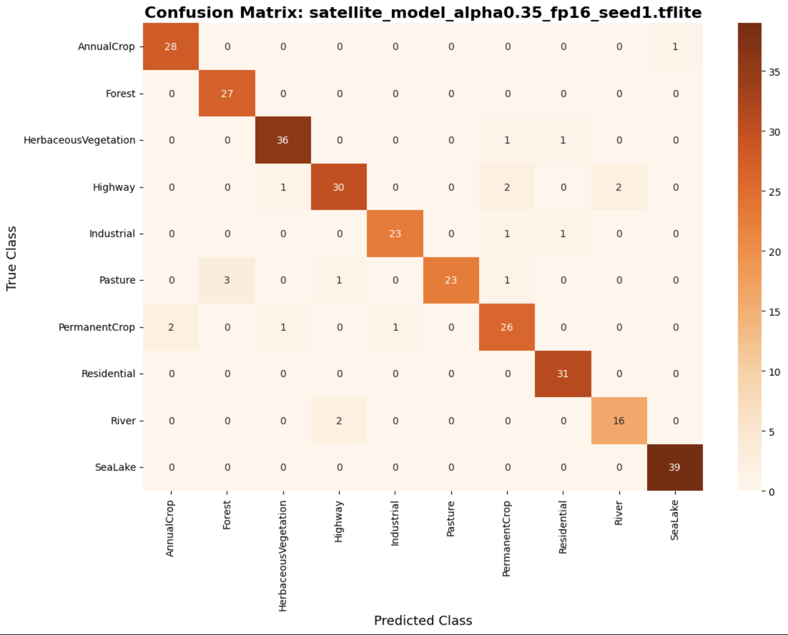

# Multi-Objective Model Compression and Quantization for Satellite Edge Inference

## Overview
This project investigates post-training model compression and quantization strategies for deploying convolutional neural networks on resource-constrained satellite onboard hardware.

Using the EuroSAT RGB dataset, multiple MobileNetV2 models with varying width multipliers (α) were trained, quantized (FP16 and INT8), and evaluated under deployment-oriented constraints.

The study emphasizes **accuracy–latency–memory trade-offs** and applies a **weighted multi-objective model selection framework** inspired by onboard autonomy and edge ML requirements.

---

## Key Contributions
- Multi-seed training for statistical robustness
- Post-training FP16 and full INT8 quantization using TensorFlow Lite
- Balanced per-class calibration for INT8 quantization
- Latency benchmarking using TFLite interpreters
- Weighted multi-objective model selection (accuracy, latency, memory)
- Deployment-oriented visualization of trade-offs

---

## Dataset
- **EuroSAT RGB**
- 10 land-use classes
- Satellite imagery (Sentinel-2)

---

## Model Architecture
- MobileNetV2 backbone (ImageNet pretrained)
- Width multipliers: α ∈ {1.0, 0.5, 0.35}
- Frozen backbone + lightweight classification head

---

## Quantization Strategy
- FP32 baseline
- FP16 post-training quantization
- Full INT8 quantization with:
  - integer-only ops
  - integer inputs/outputs
  - representative dataset calibration (120 samples/class)

---

## Evaluation Metrics
- Classification accuracy
- Inference latency (ms/sample)
- Model size (MB)

Metrics are averaged across three random seeds per configuration.

---

## Model Selection
Models are selected using a weighted multi-objective score:

| Metric | Symbol | Weight | Objective |
|------|------|------|------|
| Accuracy | A_norm | 0.30 | Maximize |
| Latency | L_norm | 0.35 | Minimize |
| Model Size | S_norm | 0.35 | Minimize |

Score = Σ (weight × normalized metric)

---

## Model Trade-off Analysis

The following figure shows the accuracy–latency–model size trade-off
across all FP32, FP16, and INT8 MobileNetV2 variants evaluated in this work.

## Final Model Evaluation

We identified the top-performing model using the weighted multi-objective score and then verified its class-wise performance using the EuroSAT test set.

---

## Reproducibility
All experiments were conducted in Google Colab with TensorFlow and TensorFlow Lite.
Training, quantization, and evaluation pipelines are fully reproducible using the provided notebook.

---

## Contributors
- Umutcan Uyan (@Uyann1)
- Bahri Uyan (@DaTTeBaY0o00)
